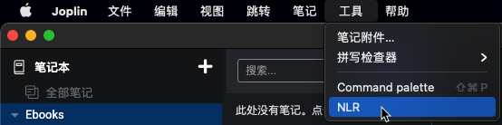
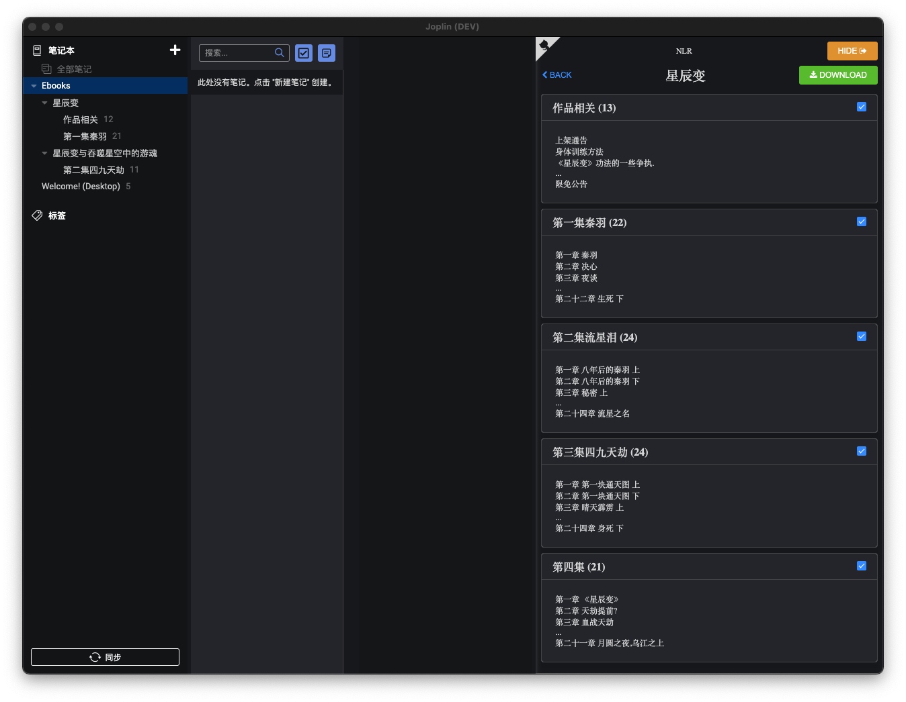

## 描述
本插件可以将joplin变成一个网文小说阅读器，资源来自互联网。
## 插件使用说明
### 1. 插件安装后会在工具菜单添加一项：**NLR**

### 2. 点击 **NLR** 打开新的panel，即可在输入框输入书名或作者名称搜索小说

### 3. 点击卡片右上方 **INFO** 打开新的小说目录，章节卡片右上checkbox选中即代表下载此chapter，选中后，点击上方**DOWNLOAD**开始下载，在笔记列表中即可看到小说文本了。

## Build & Update Framework
### Joplin Plugin

This is a template to create a new Joplin plugin.

The main two files you will want to look at are:

- `/src/index.ts`, which contains the entry point for the plugin source code.
- `/src/manifest.json`, which is the plugin manifest. It contains information such as the plugin a name, version, etc.

### Building the plugin

The plugin is built using Webpack, which creates the compiled code in `/dist`. A JPL archive will also be created at the root, which can use to distribute the plugin.

To build the plugin, simply run `npm run dist`.

The project is setup to use TypeScript, although you can change the configuration to use plain JavaScript.

### Updating the plugin framework

To update the plugin framework, run `npm run update`.

In general this command tries to do the right thing - in particular it's going to merge the changes in package.json and .gitignore instead of overwriting. It will also leave "/src" as well as README.md untouched.

The file that may cause problem is "webpack.config.js" because it's going to be overwritten. For that reason, if you want to change it, consider creating a separate JavaScript file and include it in webpack.config.js. That way, when you update, you only have to restore the line that include your file.
